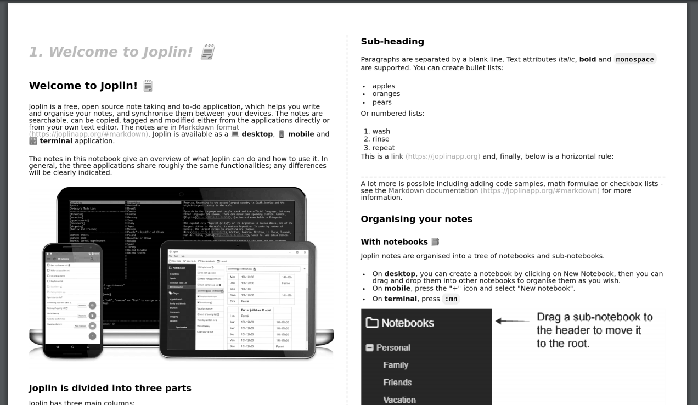

# How my [Joplin](https://joplinapp.org/) looks like

Based on the dark theme from [@xplosionmind](https://github.com/xplosionmind/joplin-theme)

Modified to look more like the [One Dark Pro](https://github.com/Binaryify/OneDark-Pro) on vscode.
Took some inspiration on the PHPStorm [Nord](https://www.nordtheme.com/ports/jetbrains) theme.

- Added margins to the editor
- Add custom headers (with 1 color per header)
- Custom notes separator
- Better reading experience (subjective)
- fixed note links contrast with new modern icon
- responsive multi-column markdown render
- 2-column export for pdf

## joplin theme
# dark mode
a dark mode theme for Joplin.

Joplin is an open source note taking app. Learn more about [Joplin](http://joplinapp.org).

It has been tested on Mac version Joplin Joplin 1.0.232 (prod, darwin)

## Screenshots


## 1. Install Font

This theme assumes you have IBM Plex Sans and IBM Plex Mono installed on your computer.

Install those from [https://github.com/IBM/plex](https://github.com/IBM/plex) or change the following lines in the `:root` section of  `userstyle.css` and `userchrome.css` to your favorite font:
```
--font-sans: "IBM Plex Sans";
--font-mono: "IBM Plex Mono";
```

## 2. Install Theme
- Open the Joplin app
- Navigate to  `Joplin > Preferences > Appearances`
- Click `Advanced Settings`
- Click `Custom stylesheet for rendered Markdown` and paste the content from `userstyle.css`
- Edit `Custom stylesheet for Joplin-wide app styles` and paste the content from `userchrome.css`


### Apply Changes
The css changes won't apply until you close and reopen the app.

HINT: If you are using Dev Tools to mess with CSS `Help > Toggle Developer tools`, you can hit `Command-R` (Mac) to Force Reload the app to apply the CSS without having to quit.

## 3. Check to see how it looks.
You can paste `css-sample.md` into a new Joplin note to see it in action.

- Make sure to select the "Dark" Theme in `Joplin > Preferences > Appearances`
- Editor font size is set to 14


- HINT: I often have to force quit and restart the app after applying CSS changes and switching notes, not sure why.

## Installation

`userchrome.css` is used to style the entire app, `userstyle.css` is used to style the parsed markdown, instead.

In order to use these stylesheets, place them in `~/.config/joplin-desktop/` on linux, and in `%userprofile%\.config\joplin-desktop\` on windows.

### fonts used in this custom theme :

- Editor font family : [Fira Code](https://github.com/tonsky/FiraCode) font size at 13
- [Noto Sans JP](https://fonts.google.com/specimen/Noto+Sans+JP)
- [Roboto](https://fonts.google.com/specimen/Roboto)

## What it looks like

[](https://www.youtube.com/watch?v=f7V8PbmumOY)


## Responsive markdown render


## How to enable those header styles (h1 to h6)

If you want to use those, don't forget to enable the rich markdown plugin and check this option bellow :


## PDF 2-column example (for grayscale printing)


